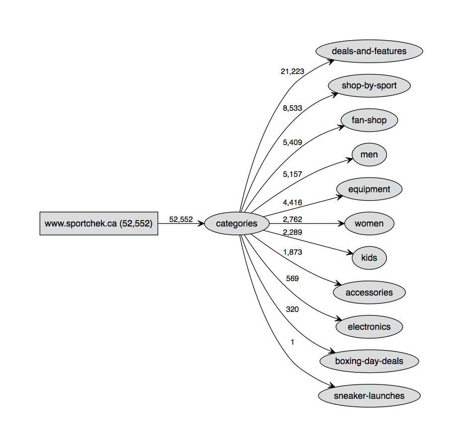

# Visualizing an XML sitemap using Python

Source code repository for the ["How to visualize an XML sitemap using Python"](https://www.ayima.com/guides/how-to-visualize-an-xml-sitemap-using-python.html) Ayima blog post.



## Extraction, Categorization and Visualization

The code has been split into three scripts that can be [downloaded here](https://github.com/Ayima/sitemap-visualization-tool/archive/master.zip). Running these requires Python and external library dependencies as [detailed in the section below](#dependencies).

### Reproducing our Results

Before plugging in a new sitemap, you may wish to test the script by reproducing a result from our blog post. This can be done by opening a terminal session, navigating to the folder containing the three `.py` scripts and running the following commands:

```
python extract_urls.py   
python categorize_urls.py   
python visualize_urls.py   
```

### Plugging in an XML Sitemap URL

A custom sitemap URL can be ingested by passing arguments to the extraction script. The commands to execute would look something like this (where we are categorizing and visualizing with a granularity depth of 3):

```
python extract_urls.py --url "site.com/sitemap-index.xml"   
python categorize_urls.py --depth 3   
python visualize_urls.py --depth 3 --title "My Sitemap" --size "20"   
```

If your XML sitemap file contains the page URLs (instead of linking to other sitemaps) then make sure to pass the `--not_index` argument:

```
python extract_urls.py --url "site.com/sitemap.xml" --not_index
```

There is also built in support for compressed XML files:

```
python extract_urls.py --url "site.com/sitemap.xml" --not_index --gzip
```

The `visualize_urls.py` script also has a `--limit` argument that can be passed. This can be used to limit the number of edges spawning from a node, and is useful for creating deep sitemap visualizations that don't grow out of control. For example:

```
python categorize_urls.py --depth 6   
python visualize_urls.py --depth 6 --limit 2 --size "30"   
```

More detailed usage instructions are included in the header of each file.

### Categorizing and Visualizing a list of URLs

If you already have a list of URLs, they can be compiled into a file named `sitemap_urls.dat` that contains one URL per line, and then processed by running the latter two scripts:

```
python categorize_urls.py   
python visualize_urls.py   
```

Please ensure you have installed the dependencies before attempting to run the scripts.

<a name="dependencies"></a>
## Dependencies

The code can run in Python 2 or 3 and the external library dependencies are as follows:

 - Requests and BeautifulSoup4 for `extract_urls.py`
 - Pandas for `categorize_urls.py`
 - Graphviz for `visualize_urls.py`

Once you have Python, these libraries can most likely be installed on any operating system with the following terminal commands:

```
pip install requests   
pip install beautifulsoup4   
pip install pandas   
```

The Graphviz library is more difficult to install. On Mac it can be done with the help of homebrew:

```
brew install graphviz   
pip install graphviz   
```

For other operating systems or alternate methods, check out the [installation instructions in the Graphviz documentation](http://graphviz.readthedocs.io/en/latest/manual.html).

___
### Contact

We are here to help! If you run into any problems you can reach out to us on twitter [@ayima](http://twitter.com/ayima).
